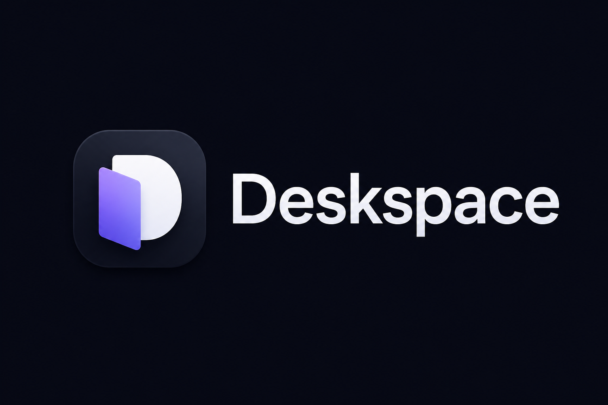

# Deskspace

**Deskspace** is a high-performance spatial window manager that reimagines the Windows desktop as an infinite 2D canvas. It eliminates the constraints of physical monitor boundaries by allowing you to organize your applications in a massive virtual workspace, providing seamless navigation through fluid panning, zooming, and a powerful real-time overview of your entire workflow.

## 🚀 Features

- **Infinite Canvas:** Pan and zoom across a massive virtual workspace.
- **Overview Mode:** See all your windows at once with live DWM thumbnails.
- **Minimap:** A persistent "radar" to help you navigate your spatial layout.
- **Window Snapping:** Magnetic edges make it easy to align windows in virtual space.
- **Glassmorphic UI:** A modern, cyber-inspired aesthetic.

## 🖱️ Controls & Navigation

### Global Mouse Controls
- **Pan Canvas:** `Middle Mouse Drag` anywhere on the screen.
- **Zoom In/Out:** `Ctrl + Mouse Wheel`.

### Hotkeys
- **Toggle Overview:** `Win + Space` (View all windows at once).
- **Toggle Minimap:** `Win + M` (Show/Hide the navigation radar).
- **Reset Camera:** `Win + Home` (Center the view back to 0,0).

### Minimap Interaction
- **Navigate:** `Left Click` or `Drag` on the Minimap to jump to locations.
- **Center Camera:** `Middle Click` on the Minimap.
- **Move Minimap:** `Drag` the border or title bar of the Minimap window to reposition it.

### Overview Mode
- **Arrange:** `Drag` window cards to move them in virtual space.
- **Focus:** `Double Click` a window card to jump to it and exit Overview.
- **Pan/Zoom:** Use `Left Mouse Drag` on empty space to move the overview camera.

## 🛠️ Getting Started

1. Run `Deskspace.exe`.
2. Look for the neon icon in your **System Tray**.
3. Right-click the Tray Icon to access settings, pause the canvas, or restore all windows to their original positions.
4. Use `Win + M` to open your Canvas Map and start exploring!
